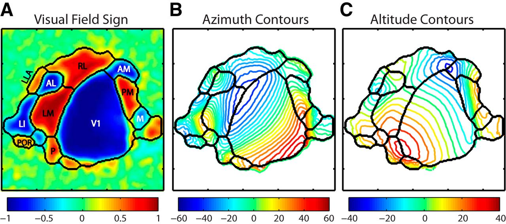
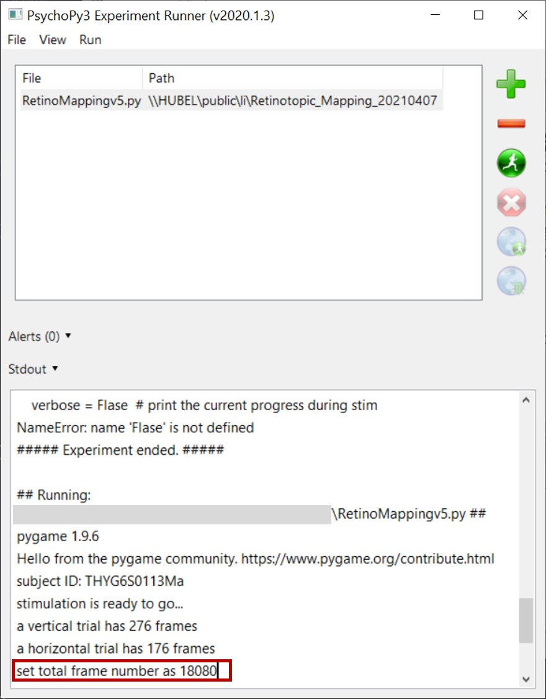
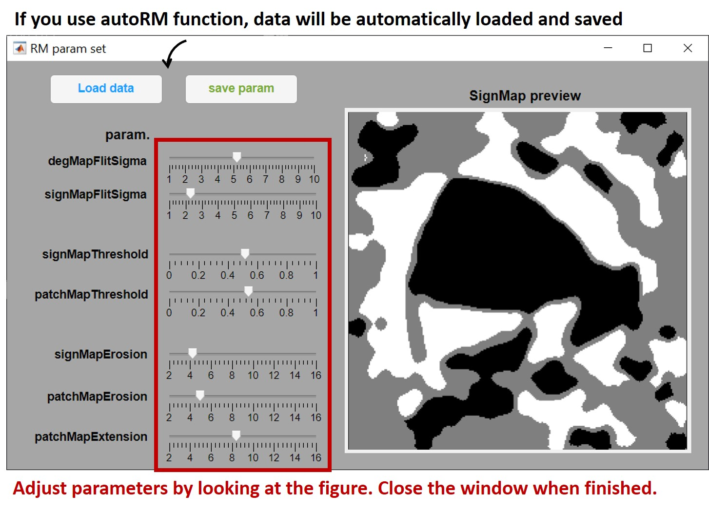
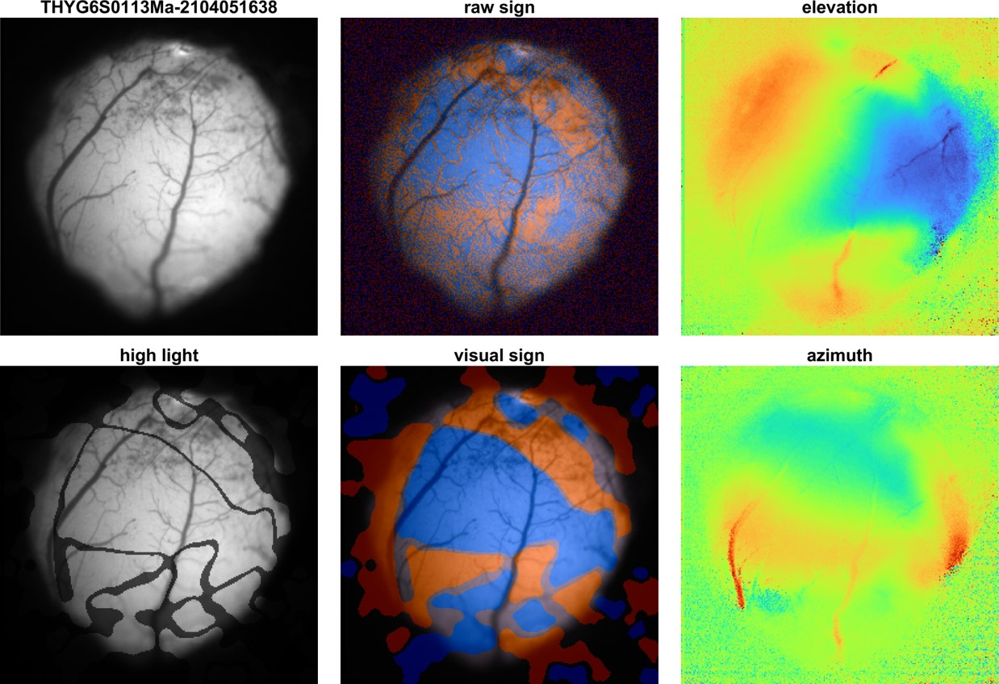

# autoRM: an Automatic Retinotopic Mapping Tool for Mice

version 1.0

release date 2021/4/19

written by Ruix. Li

---
**autoRM** provides a fully automatic tool for mice retinotopic mapping. It can help you to locate the primary and several higher-order visual cortex of mice with calcium or optical imaging (figure from ref [1]).

## What you need to use autoRM

1. **Psychopy3** (>=2020.1.3) to present visual stimulus
2. **NI-DAQ** USB-6501 digital I/O Device and NI-DAQmx driver for synchronization
3. **MATLAB** (>=2019a) with image processing toolbox

## The content of autoRM

* `RetinotopicMappingv5.py` is a Python script to present visual stimulus for retinotopic mapping, a typical experiment last about 30 minutes.
* `RMDegMap.m` is a MATLAB function to calculate visual degree, naming **azimuth** and **elevation**.
* `RMSetParam.m` is a MATLAB app helps you to determine parameters used in `RMAreaMAp.m`.
* `RMAreaMap.m` is a MATLAB function to identify visual areas, see ref [2] for details.
* `autoRM.m` is ***the MATLAB function you use***, it calls `RMDegMap` `RMSetParam` and `RMAreaMap`, usually you don't need to use other functions.

## How to use

1. MATLAB image processing toolbox is required.
2. Run `RetinotopicMappingv5.py` with psychopy3 before start recording. Recommend using a NI-DAQ digital I/O device to synchronize your camera with the visual stimulus.
3. The Python program will return the frame number required for recording. ***Set the frame number in your camera control interface.***

4. After stimulus finish, `RetinotopicMappingv5.py` will save a txt log file and a json configuration file. ***The json file is required in the following steps.***
5. Convert your recording data into `.mat` data.
6. Add `RMDegMap.m`, `RMSetParam.m` and `RMAreaMap.m` to your MATLAB path, then call `autoRM` in MATLAB command window and follow the instructions to select recording data `.mat` file and `.json` configration files.
7. A GUI will pop-up for you to adjust parameters.

8. `autoRM` will create a figure for you at the path of `.json` config file. This figure can be used as retinotopic mapping reference for your subsequential experiments.

## Inputs and outputs

### **autoRM** need the following input to work

* **XYT image data**: the image data for analysis

* **configuration json file**: the json file generated by `RetinotopicMappingv5.py`, which contains experiment configurations for data process.

### **autoRM** save the following data

#### **degMap** mat file contains the following data

* `FOV`: a image of field of view

* `dataL2R`, `dataR2L`: trial average data of left to right and right to left

* `dataD2U`, `dataU2D`: trial average data of down to up and up to down

* `phaseMaps`: phase maps of trial average data obtained from FFT.

* `degMaps`: degree maps connect visual areas with visual field.

* `degMapAzi`: azimuth map. Here assume the azimuth at front of mouse is 0. Azimuth usually ranges from 0 to 120 degree.

* `degMapElv`: elevation map. Here assume the elevation at front of mouse is 0. Elevation ususally ranges from -40 to 40 degree.

#### **areaMap** mat file contains the following data

* `rSignMap`: raw sign map calculated from `degMapAzi` and `degMapElv`

* `signMap`: sign map after image process to reduce noise and artifacts.

* `areaMap`: a bit map indicate visal areas.

* `signFOV`: align sign map to FOV.

* `hltFOV`: high light visual areas in FOV.

**autoRM** save 2 figures

---

## Endnote

References:

[1] Marshel, James H., et al. "Functional specialization of seven mouse visual cortical areas." Neuron 72.6 (2011): 1040-1054.

[2] Juavinett, Ashley L., et al. "Automated identification of mouse visual areas with intrinsic signal imaging." Nature protocols 12.1 (2017): 32.

[3] Zhuang, Jun, et al. "An extended retinotopic map of mouse cortex." Elife 6 (2017): e18372.
